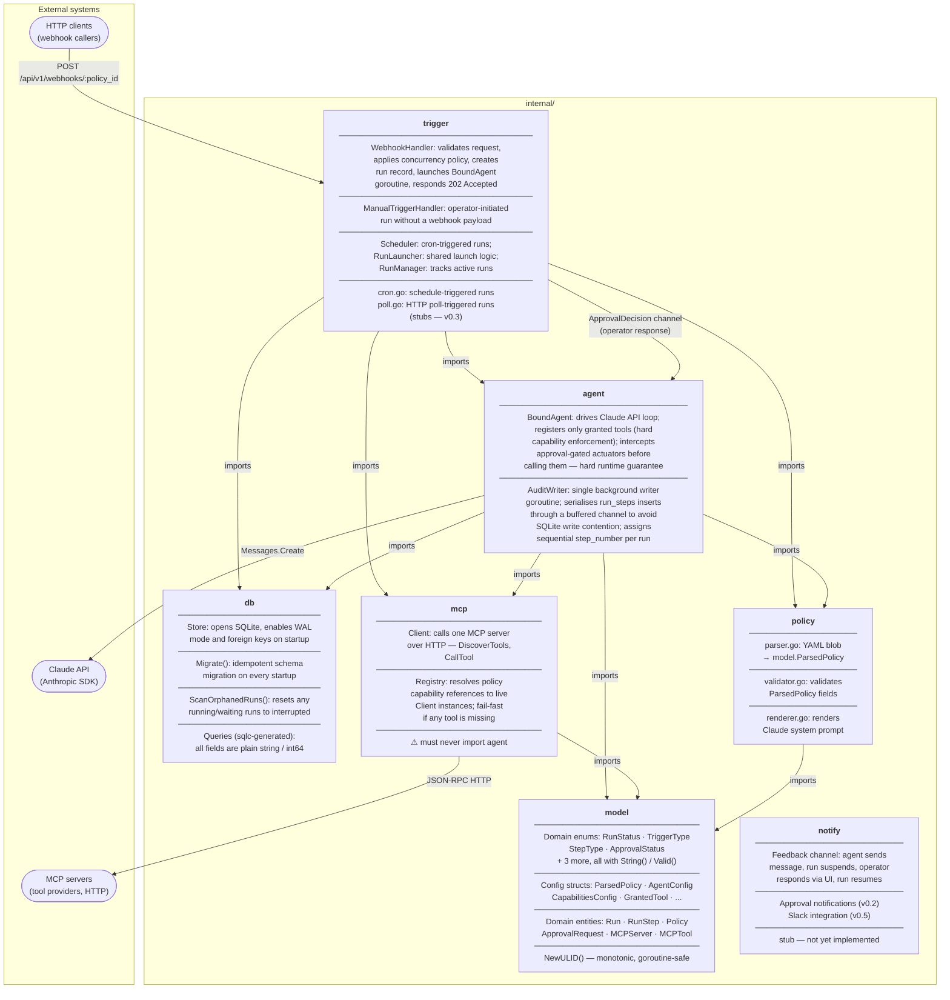
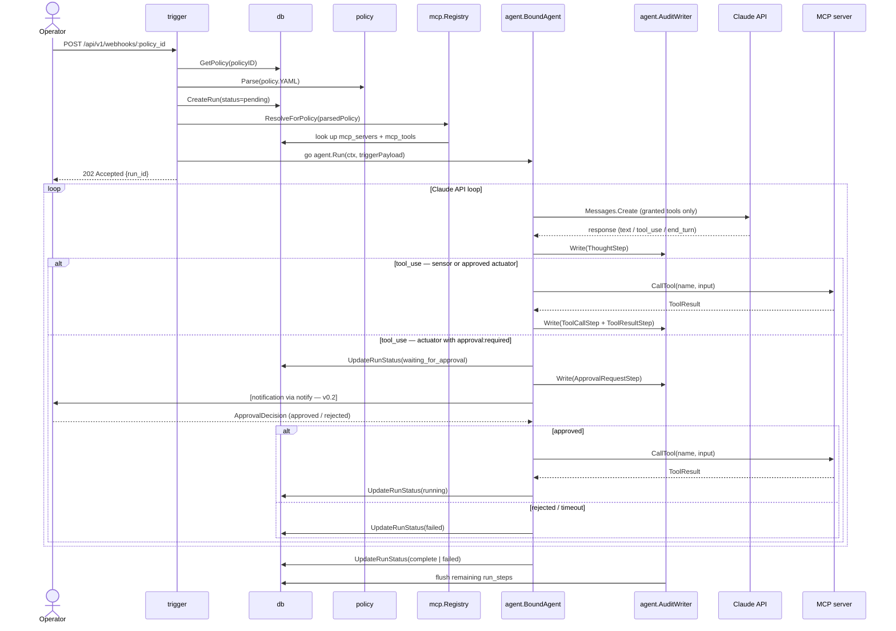

# Gleipnir Architecture

## Package dependency graph

Arrows represent import relationships. External systems are shown in rounded boxes.



## Data flow: webhook-triggered run



## Implementation status

| Package | Status | Notes |
|---|---|---|
| `internal/model` | ✅ Complete | Enums, config structs, domain entities, `NewULID()` |
| `internal/db` | ✅ Complete | `Store`, `Migrate`, `ScanOrphanedRuns`, sqlc queries |
| `internal/policy` | ✅ Complete | Parser, validator, prompt renderer, model validator, service |
| `internal/mcp` | ✅ Complete | Client, Registry, schema narrowing, URL checker |
| `internal/agent` | ✅ Complete | BoundAgent runner, AuditWriter, RunStateMachine, approval interception |
| `internal/trigger` | ⚙ Partial | WebhookHandler, ManualTriggerHandler, Scheduler, RunLauncher, RunManager, SSE integration; cron/poll stubs remain |
| `internal/notify` | 📋 Planned | Empty package; v0.2 feedback channel, v0.5 Slack |

## Key invariants

- **`internal/model` imports nothing internal.** It is the shared vocabulary; circular imports here would collapse the whole dependency graph.
- **`internal/mcp` must never import `internal/agent`.** Enforced by the Go compiler the moment it happens.
- **`internal/db` types stay as plain strings.** sqlc generates them from SQLite TEXT columns. Conversion to typed model enums happens once in the caller (trigger/agent), never inside `db`.
- **Approval interception is a hard runtime guarantee.** `BoundAgent.handleToolCall` blocks on `approvalCh` before forwarding to the MCP server — it is not prompt-based and cannot be bypassed by the model.
- **Audit writes are serialized.** `AuditWriter` funnels all `run_steps` inserts through a single goroutine to avoid SQLite write contention under parallel runs.

## Stack overview

```
┌─────────────────────────────────────────────────────────┐
│  Docker Compose                                         │
│                                                         │
│  ┌──────────────────────────────────────────────────┐  │
│  │                  Go Binary                        │  │
│  │  chi · sqlc · Anthropic · go:embed (React UI)    │  │
│  │                       │                           │  │
│  │                  ┌────▼───┐                       │  │
│  │                  │ SQLite │                       │  │
│  │                  │  WAL   │                       │  │
│  │                  └────────┘                       │  │
│  └──────────────────────────────────────────────────┘  │
└─────────────────────────────────────────────────────────┘
                              │
                    MCP HTTP transport
                              │
              ┌───────────────┼───────────────┐
              ▼               ▼               ▼
         MCP Server      MCP Server      MCP Server
        (Vikunja)       (Grafana)       (kubectl)
```

**Backend:** Go, [chi](https://github.com/go-chi/chi) router, [sqlc](https://sqlc.dev/) for type-safe queries, official [Anthropic Go SDK](https://github.com/anthropics/anthropic-sdk-go).

**Frontend:** React, embedded in the Go binary via `go:embed` and served directly by the chi router.

**Storage:** SQLite with WAL mode. Single file, zero ops, ships in the container.

**Tools:** All tools are MCP tools over HTTP transport. Gleipnir maintains its own capability metadata (tool approval gates, feedback channel) — this metadata lives in Gleipnir's DB, not in the MCP server. For stdio-only MCP servers, see the [Supergateway sidecar guide](../stdio-mcp-servers.md).
