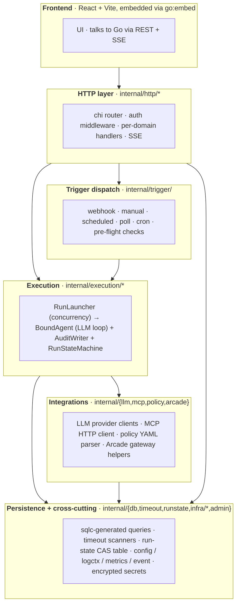
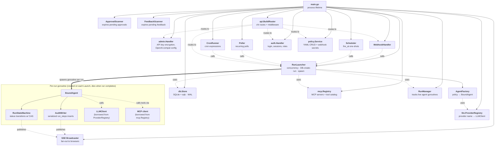
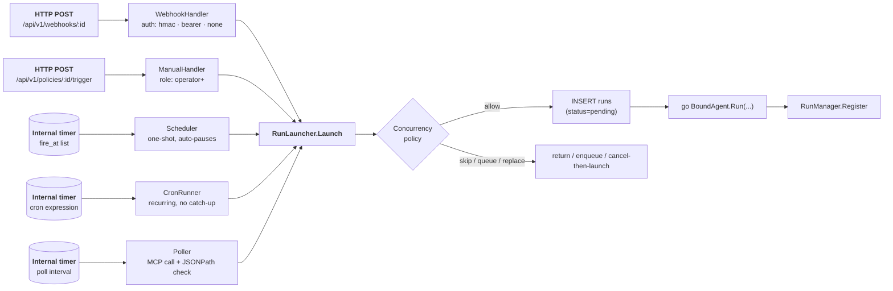

# Architecture at a Glance

A single starting page for orienting yourself: which subsystems exist, who creates whom, and how a trigger gets to an agent. Pairs with the more detailed diagrams in this folder — start here, then drill in.

## Subsystem map

The codebase divides into six subsystems. Each box is one job stated in plain English.

The single rule worth remembering: **dependencies always point downward**. The HTTP layer talks to triggers and execution; execution talks to integrations and persistence; persistence and `internal/infra/*` talk to nothing internal. `internal/mcp` is also forbidden from importing the agent package — see [package-dependencies.md](package-dependencies.md).

## Ownership tree — what `main.go` creates

`main.go` is the composition root. Every long-lived service is constructed here and wired explicitly. Read this top-down: a parent owns the lifetime and shutdown of its children.

Solid arrows = creates/owns. Dotted arrows = uses (borrowed reference, no ownership). The fat arrow into the per-run subgraph marks where short-lived goroutines fork off.

A few things worth calling out:

- **`main.go` owns everything long-lived.** The order in `run()` matters: persistence → broadcaster → registries → launcher → trigger handlers → router. Shutdown reverses this.
- **Trigger handlers are sinks for a single dependency: `RunLauncher`.** All five trigger types end at the same call site. Adding a sixth means another handler that calls `launcher.Launch(...)` — see [adding-a-trigger-type.md](../adding-a-trigger-type.md).
- **`BoundAgent` borrows, never owns, the LLM client and MCP clients.** Those live in registries with process-wide lifetime; the agent goroutine just holds a reference for the duration of one run.
- **`AuditWriter` is per-run by design.** Every step insert flows through one goroutine to avoid SQLite write contention (see invariants in [architecture.md](../architecture.md)).

## Trigger fan-in

Five trigger types, one launcher. This is the architectural keystone: regardless of how a run is initiated, the rest of the system sees it identically.

The funnel point — `RunLauncher.Launch` — is where the concurrency policy is enforced (`skip` / `queue` / `replace`), the run row is inserted, and the goroutine is spawned. From there, [run-execution-flow.md](run-execution-flow.md) takes over.

## Where to go next

| If you're trying to understand… | Read… |
|---|---|
| What happens during a run, step by step | [run-execution-flow.md](run-execution-flow.md) |
| What status a run can be in | [run-state-machine.md](run-state-machine.md) |
| How tools are restricted (and why prompt restrictions are not enough) | [capability-enforcement.md](capability-enforcement.md) |
| How real-time updates reach the browser | [realtime-events.md](realtime-events.md) |
| What's in the database | [data-model.md](data-model.md) |
| How requests flow through middleware | [auth-request-flow.md](auth-request-flow.md) |
| How shutdown is sequenced | [graceful-shutdown.md](graceful-shutdown.md) |
| Internal package boundaries and forbidden imports | [package-dependencies.md](package-dependencies.md) |
