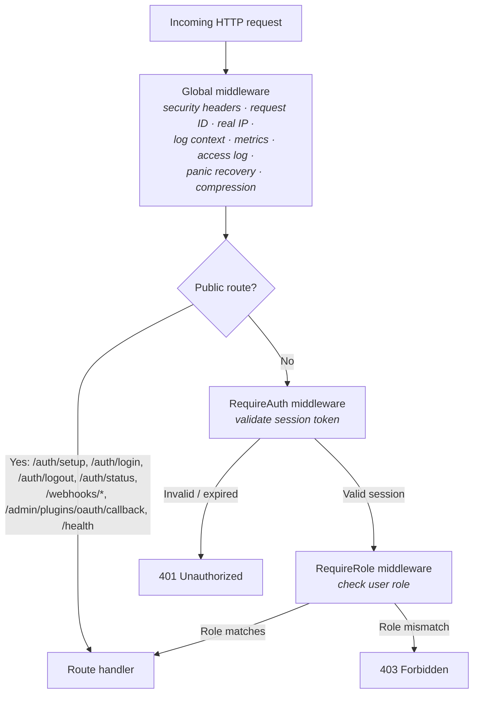

# Auth and Request Flow

```mermaid
graph TD
    REQ["Incoming HTTP request"]
    GLOBAL["Global middleware<br/><i>security headers · request ID · real IP ·<br/>log context · metrics · access log ·<br/>panic recovery · compression</i>"]
    PUBLIC{"Public route?"}
    AUTH_MW["RequireAuth middleware<br/><i>validate session token</i>"]
    ROLE_MW["RequireRole middleware<br/><i>check user role</i>"]
    HANDLER["Route handler"]

    REQ --> GLOBAL
    GLOBAL --> PUBLIC

    PUBLIC -->|"Yes: /auth/setup, /auth/login, /auth/logout, /auth/status,<br/>/webhooks/*, /admin/plugins/oauth/callback, /health"| HANDLER
    PUBLIC -->|"No"| AUTH_MW
    AUTH_MW -->|"Valid session"| ROLE_MW
    AUTH_MW -->|"Invalid / expired"| REJECT["401 Unauthorized"]
    ROLE_MW -->|"Role matches"| HANDLER
    ROLE_MW -->|"Role mismatch"| FORBIDDEN["403 Forbidden"]
```
