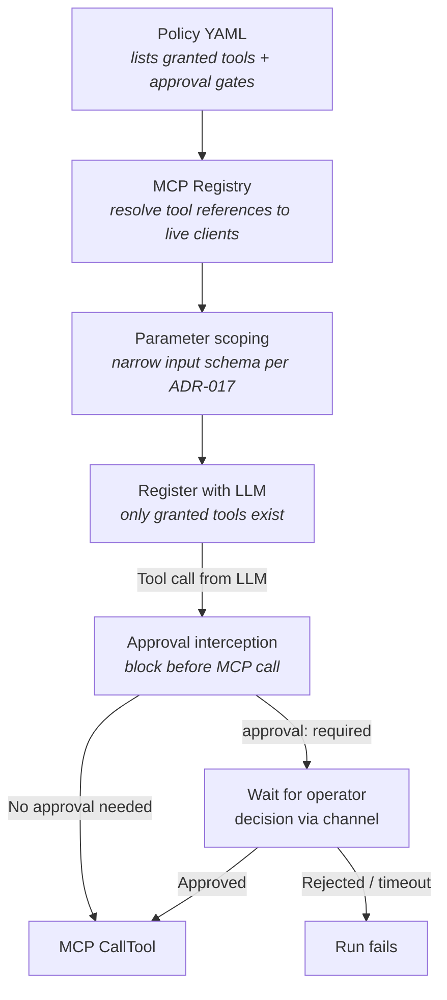

# Capability Enforcement

Tools are structurally excluded — not filtered by prompt instructions. Disallowed tools never exist from the agent's perspective (ADR-001).

```mermaid
graph TD
    POLICY["Policy YAML<br/><i>lists granted tools + approval gates</i>"]
    RESOLVE["MCP Registry<br/><i>resolve tool references to live clients</i>"]
    NARROW["Parameter scoping<br/><i>narrow input schema per ADR-017</i>"]
    REGISTER["Register with LLM<br/><i>only granted tools exist</i>"]
    INTERCEPT["Approval interception<br/><i>block before MCP call</i>"]
    CALL["MCP CallTool"]

    POLICY --> RESOLVE
    RESOLVE --> NARROW
    NARROW --> REGISTER

    REGISTER -->|"Tool call from LLM"| INTERCEPT
    INTERCEPT -->|"No approval needed"| CALL
    INTERCEPT -->|"approval: required"| WAIT["Wait for operator<br/>decision via channel"]
    WAIT -->|"Approved"| CALL
    WAIT -->|"Rejected / timeout"| FAIL["Run fails"]
```
