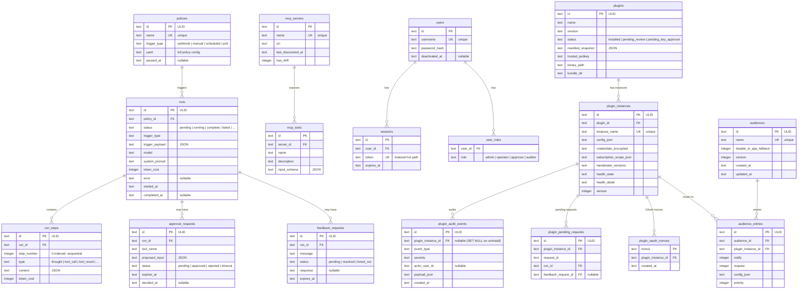

# Data Model (Core Tables)

```mermaid
erDiagram
    policies {
        text id PK "ULID"
        text name UK "unique"
        text trigger_type "webhook | manual | scheduled | poll"
        text yaml "full policy config"
        text paused_at "nullable"
    }

    runs {
        text id PK "ULID"
        text policy_id FK
        text status "pending | running | complete | failed | ..."
        text trigger_type
        text trigger_payload "JSON"
        text model
        text system_prompt
        integer token_cost
        text error "nullable"
        text started_at
        text completed_at "nullable"
    }

    run_steps {
        text id PK "ULID"
        text run_id FK
        integer step_number "0-indexed, sequential"
        text type "thought | tool_call | tool_result | ..."
        text content "JSON"
        integer token_cost
    }

    approval_requests {
        text id PK "ULID"
        text run_id FK
        text tool_name
        text proposed_input "JSON"
        text status "pending | approved | rejected | timeout"
        text expires_at
        text decided_at "nullable"
    }

    feedback_requests {
        text id PK "ULID"
        text run_id FK
        text message
        text status "pending | resolved | timed_out"
        text response "nullable"
        text expires_at
    }

    mcp_servers {
        text id PK
        text name UK "unique"
        text url
        text last_discovered_at
        integer has_drift
    }

    mcp_tools {
        text id PK
        text server_id FK
        text name
        text description
        text input_schema "JSON"
    }

    users {
        text id PK
        text username UK "unique"
        text password_hash
        text deactivated_at "nullable"
    }

    sessions {
        text id PK
        text user_id FK
        text token UK "indexed hot path"
        text expires_at
    }

    user_roles {
        text user_id FK
        text role "admin | operator | approver | auditor"
    }

    plugins {
        text id PK "ULID"
        text name
        text version
        text status "installed | pending_review | pending_key_approval"
        text manifest_snapshot "JSON"
        text trusted_pubkey
        text binary_path
        text bundle_dir
    }

    plugin_instances {
        text id PK "ULID"
        text plugin_id FK
        text instance_name UK "unique"
        text config_json
        text credentials_encrypted
        text subscription_scope_json
        text handshake_versions
        text health_state
        text health_detail
        integer version
    }

    plugin_audit_events {
        text id PK "ULID"
        text plugin_instance_id FK "nullable (SET NULL on uninstall)"
        text event_type
        text severity
        text actor_user_id "nullable"
        text payload_json
        text created_at
    }

    plugin_pending_requests {
        text id PK "ULID"
        text plugin_instance_id FK
        text request_id
        text run_id FK
        text feedback_request_id FK "nullable"
    }

    plugin_oauth_nonces {
        text nonce PK
        text plugin_instance_id FK
        text created_at
    }

    audiences {
        text id PK "ULID"
        text name UK "unique"
        integer disable_in_app_fallback
        integer version
        text created_at
        text updated_at
    }

    audience_entries {
        text id PK "ULID"
        text audience_id FK
        text plugin_instance_id FK
        integer notify
        integer request
        text config_json
        integer priority
    }

    policies ||--o{ runs : "triggers"
    runs ||--o{ run_steps : "contains"
    runs ||--o{ approval_requests : "may have"
    runs ||--o{ feedback_requests : "may have"
    mcp_servers ||--o{ mcp_tools : "exposes"
    users ||--o{ sessions : "has"
    users ||--o{ user_roles : "has"
    plugins ||--o{ plugin_instances : "has instances"
    plugin_instances ||--o{ plugin_audit_events : "audits"
    plugin_instances ||--o{ plugin_pending_requests : "pending requests"
    plugin_instances ||--o{ plugin_oauth_nonces : "OAuth nonces"
    audiences ||--o{ audience_entries : "entries"
    plugin_instances ||--o{ audience_entries : "routes to"
```
