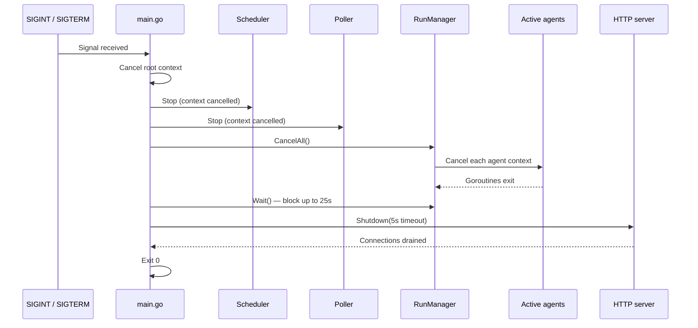

# Graceful Shutdown Sequence

```mermaid
sequenceDiagram
    participant SIG as SIGINT / SIGTERM
    participant MAIN as main.go
    participant SCHED as Scheduler
    participant POLL as Poller
    participant RM as RunManager
    participant AGENTS as Active agents
    participant HTTP as HTTP server

    SIG ->> MAIN: Signal received
    MAIN ->> MAIN: Cancel root context
    MAIN ->> SCHED: Stop (context cancelled)
    MAIN ->> POLL: Stop (context cancelled)
    MAIN ->> RM: CancelAll()
    RM ->> AGENTS: Cancel each agent context
    AGENTS -->> RM: Goroutines exit
    MAIN ->> RM: Wait() — block up to 25s
    MAIN ->> HTTP: Shutdown(5s timeout)
    HTTP -->> MAIN: Connections drained
    MAIN ->> MAIN: Exit 0
```
