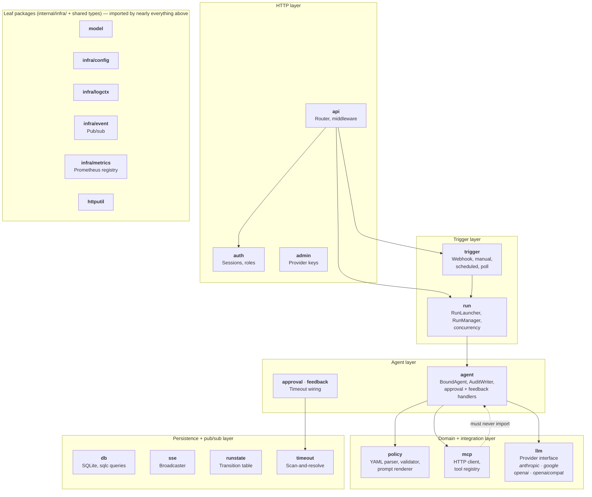

# Package Dependency Graph

Packages are grouped by layer. Arrows show the primary architectural relationships — not every import. Packages in lower layers (`model`, `db`, `infra/config`, `infra/logctx`, `httputil`) are widely imported and omitted from the arrows to reduce noise.

