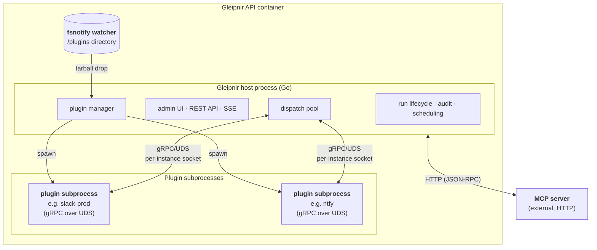
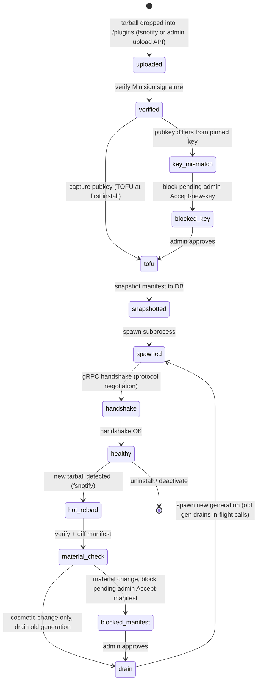

# Plugin Process Model

How the host launches, manages, and communicates with plugin subprocesses. Mirrors `docs/developer/plugin-system-spec.md` §3.1.

## Process topology

> Each plugin instance gets its own Unix domain socket. The dispatch pool holds one gRPC connection per running instance; the MCP client holds HTTP connections to external MCP servers. Both share the same `<source>.<tool>` namespace via `internal/toolregistry`.

## Generation lifecycle

Plugin instances go through a well-defined lifecycle from install to running. Hot-reload replaces a generation without stopping in-flight calls.

> **Generation** — a specific subprocess incarnation of an instance. The old generation continues serving in-flight calls (via `internal/plugin/generation` refcounts) while the new generation starts. Once the old generation's refcount reaches zero it is killed.

## Notes

- **Identity tokens** — each subprocess generation receives a unique `GLEIPNIR_INSTANCE_TOKEN` at spawn. The `hostsvc.UnaryInstanceTokenInterceptor` validates the token on every Host RPC. A killed generation's token is immediately revoked so it cannot impersonate the new generation.
- **Generation refcounts** — `internal/plugin/generation.Controller` tracks in-flight Host RPCs per generation. `BeginDrain` blocks new traffic and waits for old-gen refcount to reach zero before force-cancelling stragglers (5s grace).
- **Host RPCs** — plugins call back to the host via 8 always-on Tier-1 RPCs (`GetInstanceConfig`, `GetCredentials`, `GetRunContext`, `WriteAuditStep`, `EmitMetric`, `EmitEvent`, `Log`, `SetHealthState`) and 2 capability-gated Tier-2 RPCs (`RunHistoryRead`, `UserDirectoryRead`).
- For the full design specification see `docs/developer/plugin-system-spec.md`.
