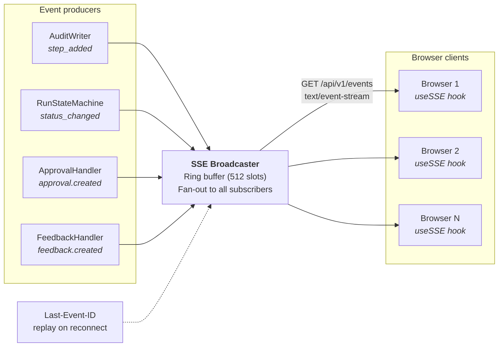

# Real-time Event Flow

SSE delivers live updates from the backend to all connected browser clients.

```mermaid
graph LR
    subgraph producers["Event producers"]
        AW["AuditWriter<br/><i>step_added</i>"]
        SM["RunStateMachine<br/><i>status_changed</i>"]
        AH["ApprovalHandler<br/><i>approval.created</i>"]
        FH["FeedbackHandler<br/><i>feedback.created</i>"]
    end

    BROADCASTER["<b>SSE Broadcaster</b><br/>Ring buffer (512 slots)<br/>Fan-out to all subscribers"]

    subgraph consumers["Browser clients"]
        B1["Browser 1<br/><i>useSSE hook</i>"]
        B2["Browser 2<br/><i>useSSE hook</i>"]
        BN["Browser N<br/><i>useSSE hook</i>"]
    end

    AW --> BROADCASTER
    SM --> BROADCASTER
    AH --> BROADCASTER
    FH --> BROADCASTER

    BROADCASTER -->|"GET /api/v1/events<br/>text/event-stream"| B1
    BROADCASTER --> B2
    BROADCASTER --> BN

    RECONNECT["Last-Event-ID<br/>replay on reconnect"] -.-> BROADCASTER
```
