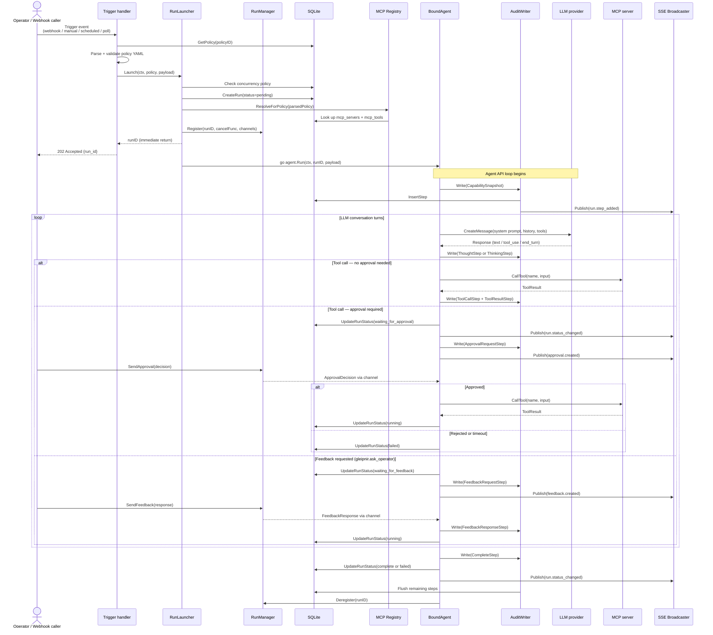

# Trigger and Run Execution Flow

How a run is created, launched, and executed — regardless of trigger type.

```mermaid
sequenceDiagram
    actor Op as Operator / Webhook caller
    participant T as Trigger handler
    participant RL as RunLauncher
    participant RM as RunManager
    participant DB as SQLite
    participant Reg as MCP Registry
    participant BA as BoundAgent
    participant AW as AuditWriter
    participant LLM as LLM provider
    participant MCP as MCP server
    participant SSE as SSE Broadcaster

    Op ->> T: Trigger event<br/>(webhook / manual / scheduled / poll)
    T ->> DB: GetPolicy(policyID)
    T ->> T: Parse + validate policy YAML
    T ->> RL: Launch(ctx, policy, payload)

    RL ->> DB: Check concurrency policy
    RL ->> DB: CreateRun(status=pending)
    RL ->> Reg: ResolveForPolicy(parsedPolicy)
    Reg ->> DB: Look up mcp_servers + mcp_tools
    RL ->> RM: Register(runID, cancelFunc, channels)
    RL -->> T: runID (immediate return)
    T -->> Op: 202 Accepted {run_id}

    RL ->> BA: go agent.Run(ctx, runID, payload)

    Note over BA,LLM: Agent API loop begins

    BA ->> AW: Write(CapabilitySnapshot)
    AW ->> DB: InsertStep
    AW ->> SSE: Publish(run.step_added)

    loop LLM conversation turns
        BA ->> LLM: CreateMessage(system prompt, history, tools)
        LLM -->> BA: Response (text / tool_use / end_turn)

        BA ->> AW: Write(ThoughtStep or ThinkingStep)

        alt Tool call — no approval needed
            BA ->> MCP: CallTool(name, input)
            MCP -->> BA: ToolResult
            BA ->> AW: Write(ToolCallStep + ToolResultStep)

        else Tool call — approval required
            BA ->> DB: UpdateRunStatus(waiting_for_approval)
            BA ->> SSE: Publish(run.status_changed)
            BA ->> AW: Write(ApprovalRequestStep)
            BA ->> SSE: Publish(approval.created)

            Op ->> RM: SendApproval(decision)
            RM -->> BA: ApprovalDecision via channel

            alt Approved
                BA ->> MCP: CallTool(name, input)
                MCP -->> BA: ToolResult
                BA ->> DB: UpdateRunStatus(running)
            else Rejected or timeout
                BA ->> DB: UpdateRunStatus(failed)
            end

        else Feedback requested (gleipnir.ask_operator)
            BA ->> DB: UpdateRunStatus(waiting_for_feedback)
            BA ->> AW: Write(FeedbackRequestStep)
            BA ->> SSE: Publish(feedback.created)

            Op ->> RM: SendFeedback(response)
            RM -->> BA: FeedbackResponse via channel

            BA ->> AW: Write(FeedbackResponseStep)
            BA ->> DB: UpdateRunStatus(running)
        end
    end

    BA ->> AW: Write(CompleteStep)
    BA ->> DB: UpdateRunStatus(complete or failed)
    BA ->> SSE: Publish(run.status_changed)
    AW ->> DB: Flush remaining steps
    BA ->> RM: Deregister(runID)
```
