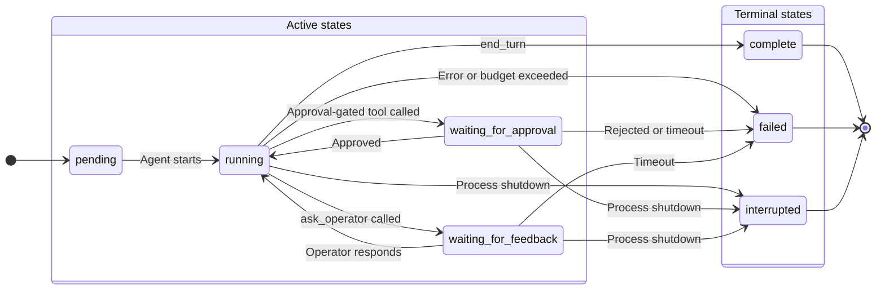

# Run Status State Machine

Every run follows this state machine. Transitions are enforced by `runstate.TransitionTable`.

```mermaid
stateDiagram-v2
    direction LR

    [*] --> pending

    state "Active states" as active {
        direction LR

        pending --> running : Agent starts

        running --> waiting_for_approval : Approval-gated tool called
        waiting_for_approval --> running : Approved

        running --> waiting_for_feedback : ask_operator called
        waiting_for_feedback --> running : Operator responds
    }

    state "Terminal states" as terminal {
        direction LR
        complete
        failed
        interrupted
    }

    running --> complete : end_turn
    running --> failed : Error or budget exceeded
    waiting_for_approval --> failed : Rejected or timeout
    waiting_for_feedback --> failed : Timeout

    running --> interrupted : Process shutdown
    waiting_for_approval --> interrupted : Process shutdown
    waiting_for_feedback --> interrupted : Process shutdown

    complete --> [*]
    failed --> [*]
    interrupted --> [*]
```
