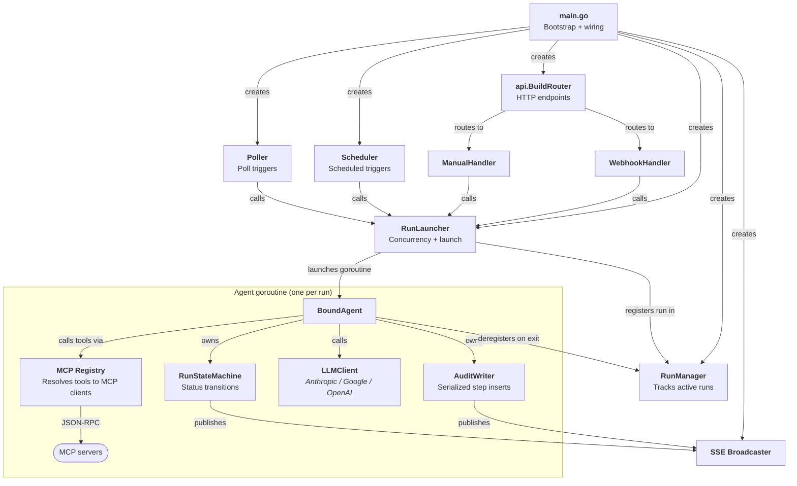

# Runtime Object Graph

How the major components are wired together at runtime, from process start through a run completing. Follow the arrows to trace a trigger from HTTP request to agent completion.

