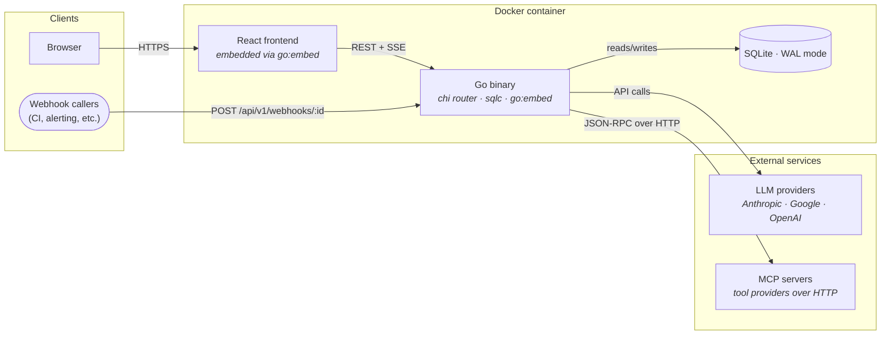

# System Overview

Gleipnir is a single Go binary that embeds a React frontend, uses SQLite for storage, and orchestrates AI agent runs by talking to external LLM providers and MCP tool servers.

```mermaid
graph LR
    subgraph clients["Clients"]
        direction TB
        BROWSER["Browser"]
        WEBHOOK_CLIENT(["Webhook callers<br/>(CI, alerting, etc.)"])
    end

    subgraph container["Docker container"]
        direction TB
        UI["React frontend<br/><i>embedded via go:embed</i>"]
        GO["Go binary<br/><i>chi router · sqlc · go:embed</i>"]
        SQLITE[("SQLite · WAL mode")]

        UI -->|"REST + SSE"| GO
        GO -->|reads/writes| SQLITE
    end

    subgraph external["External services"]
        direction TB
        LLM_PROVIDERS["LLM providers<br/><i>Anthropic · Google · OpenAI</i>"]
        MCP_SERVERS["MCP servers<br/><i>tool providers over HTTP</i>"]
    end

    BROWSER -->|"HTTPS"| UI
    WEBHOOK_CLIENT -->|"POST /api/v1/webhooks/:id"| GO
    GO -->|"API calls"| LLM_PROVIDERS
    GO -->|"JSON-RPC over HTTP"| MCP_SERVERS
```
